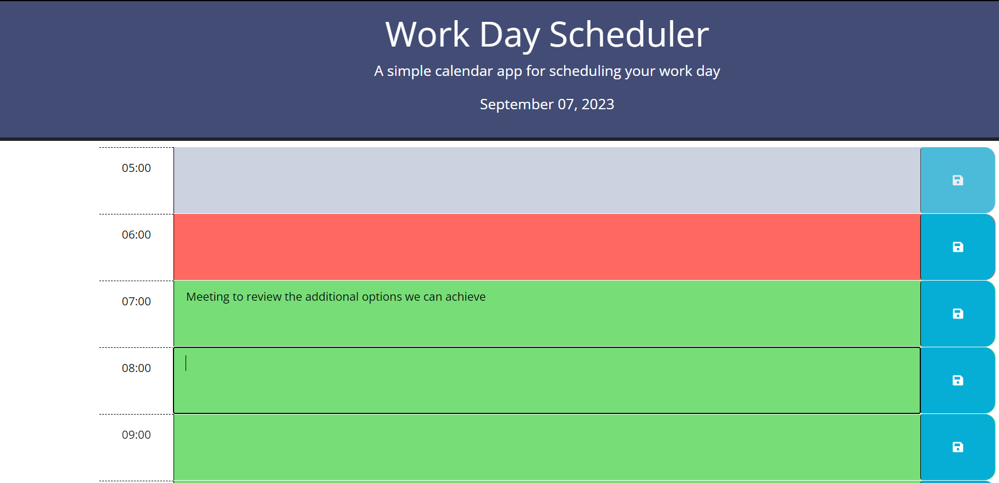
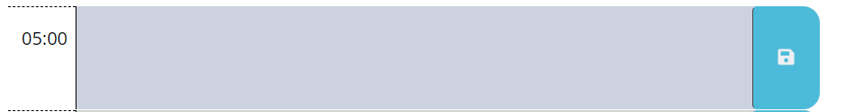

<!-- Improved compatibility of back to top link: See: https://github.com/othneildrew/Best-README-Template/pull/73 -->
<a id="readme-top" name="readme-top"></a>


<p align="center">
    
</p>

<p align="center">
    <a href="https://bootcamp.carleton.ca/">
        </a>
    <a href="" >
        </a>
    <a href="" >
        </a>
    <a href="" >
        </a>
    <a href="https://www.linkedin.com/in/gustavo-miller-42188481/">
        
    </a>
</p>
<br/>

# Carleton University - Bootcamp

## Module 05 Challenge: Third Party APIs

Create a simple calendar application that allows a user to save events for each hour of a typical working day (9am&ndash;5pm) by modifying starter code. This app will run in the browser and feature dynamically updated HTML and CSS powered by jQuery. The Work Scheduler has three different stages; past, current and future. As the days rolls, the color of the time-block will change based on the criteria just mentioned.



<!-- Source Section -->

## Source code

The source code is stored and maintained in Github; [Work Day Scheduler](https://github.com/gusmiller/work_day_scheduler). If you are reading this then you already have the URL. It includes additional documents that helped the development of the Work Day Schedule application. The public application can be found here:

```
https://gusmiller.github.io/work_day_scheduler/
```

The code is divided in separate folders:

| Folder Name | Description                                                    |
| ----------: | -------------------------------------------------------------- |
|        Main | This is where the HTML pages are located, license and Readme   |
|             | are stored.                                                    |
|   Documents | Contain original mockup and other useful information           |
|      Assets | Contain different folders to hold CSS, Images and JavaSctipts. |

The latest version is <strong>Version 002</strong>. To visit the application and participate please click <a href="https://gusmiller.github.io/work_day_scheduler/">Work Day Scheduler</a>

<!-- Business Requirements Section -->

## Business Requirements

The Code Quiz application should welcome the user and offer the option to participate. When user starts the process it will be presented with 5 questions prompted one at the time. Each question answered correctly will earn the user 20 points, but in the other hand if user answers incorrectly then is penalize with 10 seconds. The prompts are as follow:

<ul>
    <li>Current day is displayed at the top of the calendar</li>
    <li>Presented with timeblocks for standard business hours of 9am to 5pm</li>
    <li>Timeblock is color coded to indicate whether it is in the past, present, or future</li>
    <li>User can enter an event</li>
    <li>Event text is saved in local storage</li>
    <li>Saved events persist</li>
</ul>

# Time-Block design

The layout for the Time-block for the Work Day Schedule is very simple. It is divided in three columns; time, task editor and save button. This layout will repeat for the duration of the wor day; 9am to 5pm, color coded depending whether the day is past, current or future. The layout requires to be updated on a regular basis in order to reflect the time of the day.

Here is the layout of the index.html<br/>


Depending on the availabilty of the time-block user may or may not enter information. For instance, when past, then user cannot enter information.

<p align="right">(<a href="#readme-top">back to top</a>)</p>

<!-- Notes Section -->

## Notes to consider

The Work Day Schedule was relatively simple to code, the concept was clear and the layout was already provided. There was a lot of coding behind to handle the DOM manipulation and the localstorae data. 

> **Note**: Parameters required in the process are as follow:
>
> - Validate time block is implemented.
> - Validate time and format time-blocks accordingly.
> - Retrieve information from Local Storage (API) to make data persist.
> - Enable or disable editor based on the status of the time-block; past, current or future.

<!-- LICENSE Section -->

## Roadmap

- [x] Folder Structure
- [x] Styling
- [x] Index Page
- [x] Build logic - JavaScripts
- [x] Write Documentation
  - [ ] Technical Information
  - [ ] User Guide

See the [open issues](https://github.com/gusmiller/work_day_scheduler/issues) for a full list of proposed features (and known issues). Note: Issues found have been left <strong>open</strong> on purpose for grading purposes.

## License

Distributed under the MIT License. See `LICENSE.txt` for more information.

<!-- CONTACT Section -->

## Contact

In case you have any questions or would like me to help you in your IT needs, you may contact me at - gustavo.miller@miller-hs.com

Project Link: [https://gusmiller.github.io/work_day_scheduler/]([workscheduler-url])

<p align="right">(<a href="#readme-top">back to top</a>)</p>

---
© 2023 edX Boot Camps LLC. Confidential and Proprietary. All Rights Reserved. Developed by Gustavo Miller

<!-- MARKDOWN LINKS & IMAGES -->
<!-- https://www.markdownguide.org/basic-syntax/#reference-style-links -->
[workscheduler-url]: https://gusmiller.github.io/work_day_scheduler/